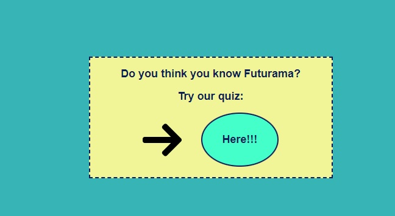

# Futurama
## Sobre

* Essa é uma aplicação que faz uso de uma api disponível em: https://sampleapis.com/api-list/futurama;
* O objetivo é manipular os dados da api utilizando **JavaScript**;
* A marcação e estilização da página é feita com **HTML**e **CSS**;
* Caso você queira visualizar a aplicação na sua máquina, basta fazer o download do arquivo zip, extrair no local de sua preferência e abrir o arquivo index.html;

## Dinamica da aplicação
* Ao abrir o arquivo index.html, é exibido o que seria a pagina inicial nele você vai visualizar informações da série como sinopse, anos de exibição e autores:

* Abaixo algumas informações dos personagens que podem ser escolhidos por um select:

* Ao final da página existe uma seção que direciona o usuário a um quiz caso ele queira:

* O usuário é direcionado a outro arquivo através de um link:

* Como é a tela após o usuário selecionar uma resposta:

* A tela ao final do quiz, fica ao critério do usuário faze-lo novamente ou retornar a página inicial:

